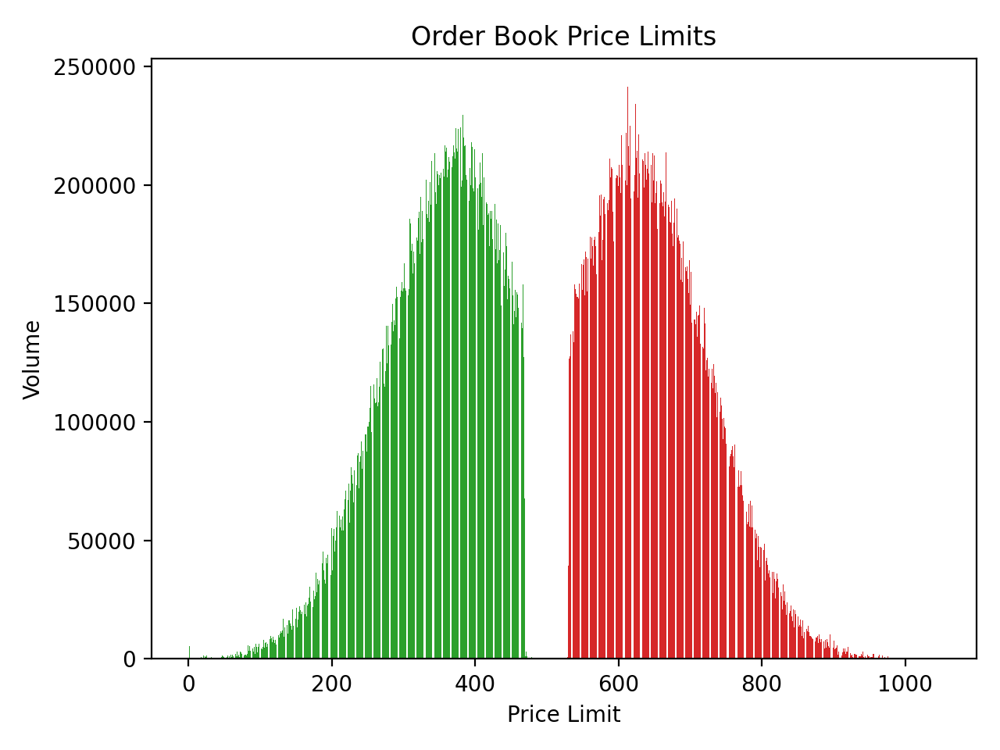

# Limit Order Book & Matching Engine

This repository contains the C++ implementation of a high-performance Limit Order Book and its Matching Engine.

     

## Overview

The Limit Order Book is designed using a combination of data structures to optimize order insertion, deletion, and matching:

### Architecture

- **Data Structures**: Orders are stored in a doubly linked-list structure, where each list represents a price level. Price levels are managed using Red-Black Trees implemented via `std::set` in C++, ensuring efficient insertion and deletion operations.

- **Order Format**: Orders are added in the format `ID, AgentID, Price, Volume`, and deleted by their id `ID`.

### Performance

To assess performance, the system was tested with 1,000,000 operations (place or delete orders), generated using a Python script. These operations were processed through a CSV parser and fed into the C++ program.

- **High-Performance**: The system achieved a peak performance of **270,000 operations per second**. Operations include order insertions, trades, and order deletions.

## Demo and Usage

For a demonstration, refer to the [Python script](demo/generate_orders.py) used to generate the orders and the corresponding CSV file. This file serves as input to the C++ program, showcasing the handling of large-scale order operations efficiently.

## References

1. [How to Build a Fast Limit Order Book](https://web.archive.org/web/20110410160306/http://howtohft.wordpress.com:80/2011/02/15/how-to-build-a-fast-limit-order-book) - Insights into designing performant limit order books.

---

This project demonstrates a robust implementation of a Limit Order Book and Matching Engine in C++, optimized for high-frequency trading environments.
